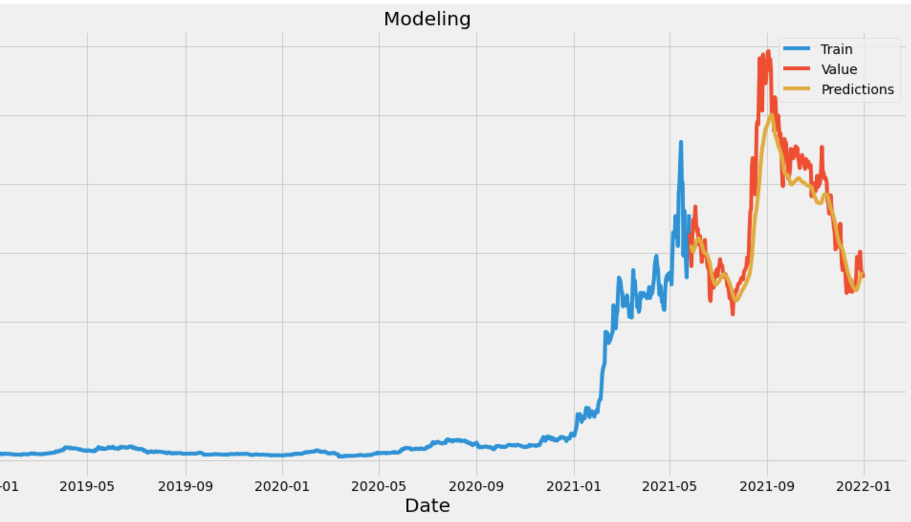

 

  

  <h3 align="center">Stock Prediction with Recurrent Neural Network LSTM</h3>

  

    <a href="https://github.com/ellissentoso/RNN Machine Learning for Stock Price Prediction"><strong>Explore the docs »</strong></a>
     
     
    <a href="https://github.com/ellissentoso/RNN Machine Learning for Stock Price Prediction">View Demo</a>
    .
    <a href="https://github.com/ellissentoso/RNN Machine Learning for Stock Price Prediction/issues">Report Bug</a>
    .
    <a href="https://github.com/ellissentoso/RNN Machine Learning for Stock Price Prediction/issues">Request Feature</a>
  

## About The Project

I created a program that uses an artificial recurrent neural network (RNN) called Long short-term memory (LSTM), which is an artificial recurrent neural network architecture used in the field of deep learning. Unlike standard feedforward neural networks, LSTM has feedback connections.

Here's why:
The stock market can be unpredictable but machine learning is one of the best ways to help do quantitative analysis.

A list of commonly used resources that I find helpful is listed in the acknowledgments.

## Built With

Jupyter Notebook and Python Programming.
Libraries: math, pandas_datareader, numpy, pandas, sklearn, matplotlib.

## Usage

### Creating A Pull Request

1. Fork the Project
2. Create your Feature Branch (`git checkout -b feature/AmazingFeature`)
3. Commit your Changes (`git commit -m 'Add some AmazingFeature'`)
4. Push to the Branch (`git push origin feature/AmazingFeature`)
5. Open a Pull Request

## Authors

* **Ellis Sentoso** - *Data Science Student* - [Ellis Sentoso](https://github.com/ellissentoso) - *Program for Stock Price Prediction using RNN*

## Acknowledgements

* [Computer Science](https://www.youtube.com/watch?v=QIUxPv5PJOY)

